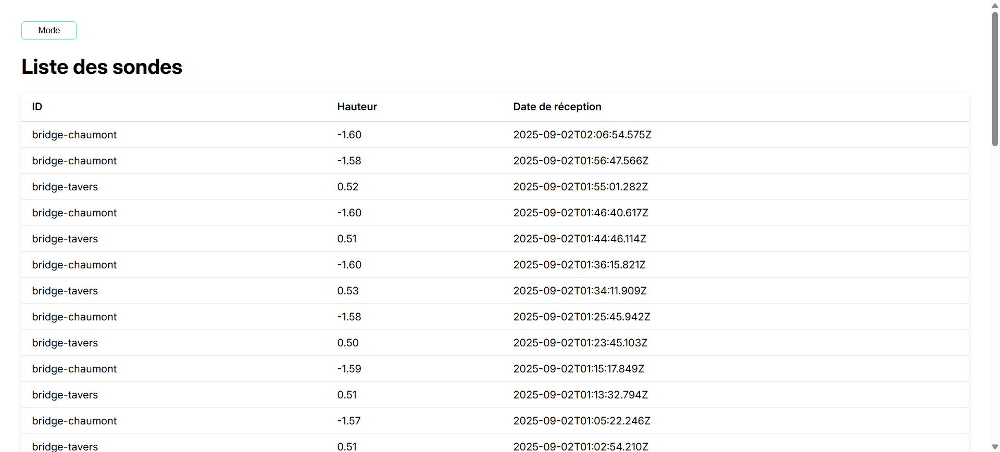
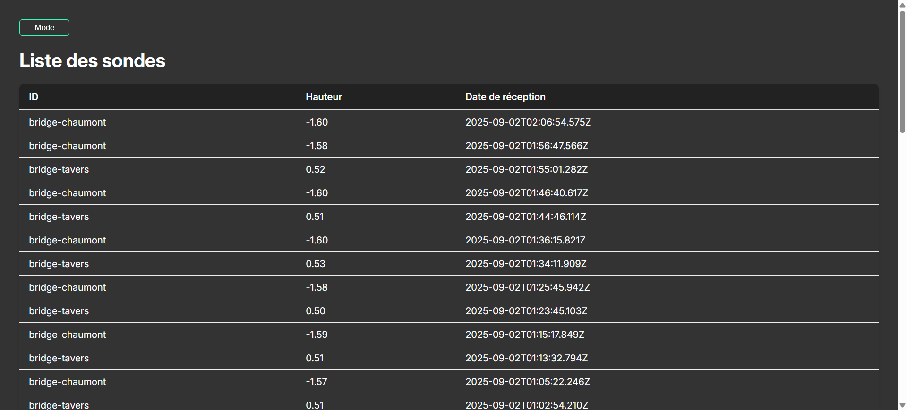
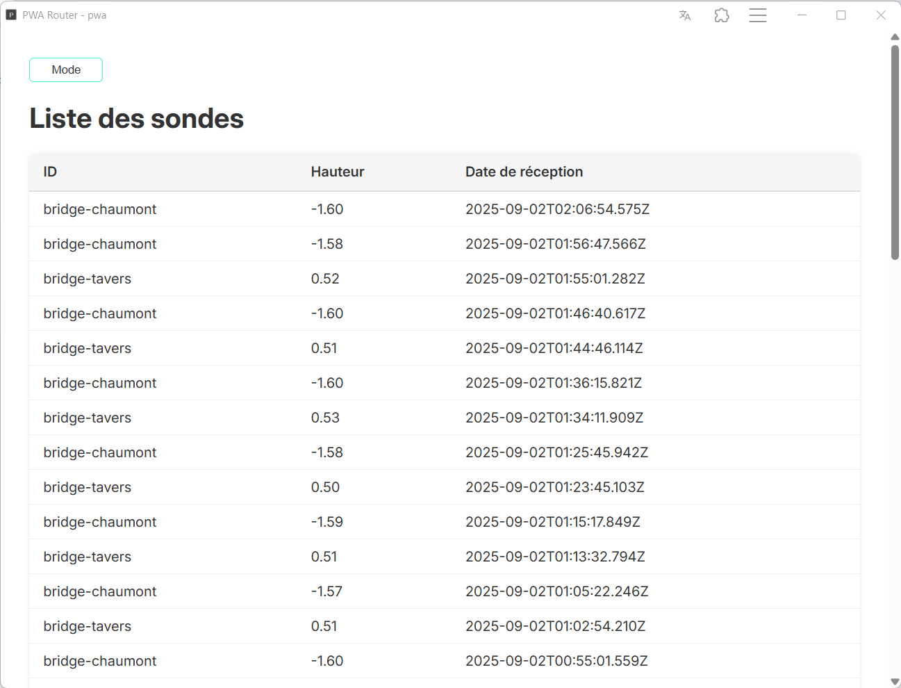

# React + Vite PWA  <!-- omit in toc -->
#### [Voir le README](./README.md)
### Capture
#### Light Mode

#### Dark Mode

#### En PWA

## Sommaire <!-- omit in toc -->
- 
      - [Voir le README](#voir-le-readme)
  - [Objectif](#objectif)
  - [Difficulté](#difficulté)
  - [Les étapes du projet et le temps passé](#les-étapes-du-projet-et-le-temps-passé)

## Objectif
- [X] Créer un repo **GitHub**
- [X] Créer le projet avec **ReactJS** et **Vite**
- [X] Configurer l'environnement
    - [X] Variables d'environnement
    - [X] Structure du projet
- [x] Identifier les **écrans nécessaires** et les concevoir
- [~] **Récupérer les données** depuis l'API et les afficher
- [X] Rendre l'application **Progressive Web App (PWA)**
    - [X] Ajouter un `manifest.json`
    - [X] Configurer le **Service Worker**
- [X] Mettre en place la **gestion des erreurs**
- [X] **Tester l'application**
    - [X] En ligne
    - [X] En mode hors-ligne
- [X] **Documenter le projet**
    - [X] Ajouter la documentation avec **JSDoc**
    - [X] Rédiger le **README**
- [~] Implémenter une **notification push** lorsque de nouvelles données arrivent (changement d'état d’un capteur)
- [X] Ajouter un **mode sombre**
- [X] **Déployer le projet sur Plesk**
## Difficulté

- Utilisation de la librairies vite PWA
- Création du fichier config
- Gestions des notifications

## Les étapes du projet et le temps passé
- Création du squelette et lecture rapide des docs. 0.5h
- Création de la function fetchSondes pour récuperer tout les sondes
  de l'api et les afficher 2.5h
- Création du fichiers configuration pour gérer le pwa ~4h
- Ajout du systéme de notifactions (demander la permissions
  et recevoir une notif de test)
- Ajout d'un sytéme de cache ~0.5/1h
- Configurations de jsdoc 0.5h
- Création de la documentation 1h
- - Ajout d'un mode sombres 1h
- Déploiement sur Plesk 0.5h